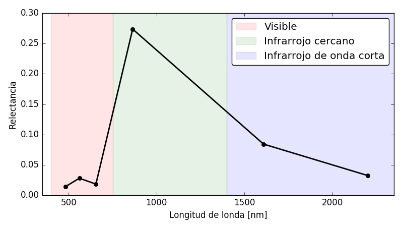

# Pregunta
La información aportada por la firma espectral de la vegetación en la zona visible del espectro electromagnético está asociada a:

* La estructura foliar de la vegetación.
* El contenido de pigmentos de la vegetación. [BIEN]
* El contenido de humedad de la vegetación.

# Retroalimentación general
La información aportada por las distitnas zonas del espectro electromagnético para la vegetación tendrán que ver con su comportamiento biofísico.

* Cambios en el contenido de pigmentos se verán reflejados en la zona del visible (en verde en la figura).
* Cambios en la estructura foliar se verán reflejados en la zona del infrarrojo cercano (en rojo en la figura)
* Cambios en el contenido de humedad se verán reflejados en la zona del infrarrojo de onda corta (en azul en la figura)

Por lo tanto al momento de estudiar el comportamiento de la vegetación será de interés incluir información provenientes de estas tres zonas para tener conocimiento de todo el comportamiento biofísico de la misma.

# Retroalimentación correcta
Respuesta correcta. Podés profundizar este tema leyendo el capitulo sobre firmas espectrales de la vegetación del Jensen.

# Retroalimentación parcial
Respuesta inco
# Retroalimentación incorrecta
Respuesta incorrecta. Recomendamos vuelvas a mirar el video sobre firmas espectrales de la vegetación.

# Multiples intentos: Pista 1
Recorda que la firma espectral de la vegetación tiene tres comportamientos diferenciados en la zona del espectro visible, la zona del inforarrojo cercano y ela zona del infrarrojo medio. Cada uno de estos comportamientos está causado por una magnitud biofísica distinta.
