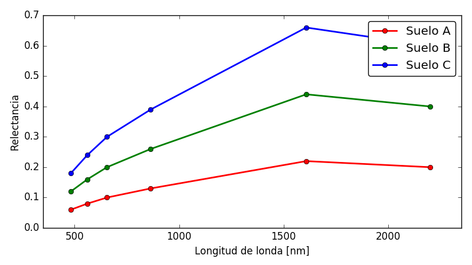
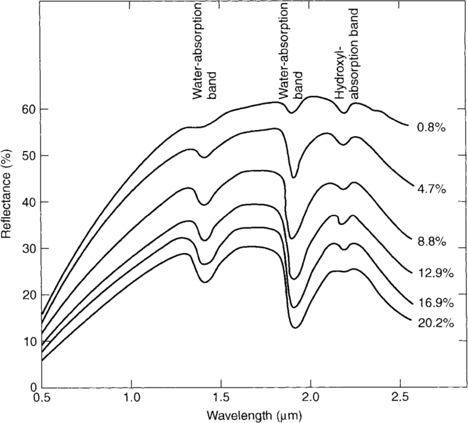

# Pregunta
¿Cual de las siguientes firmas espectrales de suelo corresponde al de mayor contenido de humedad?

* Suelo A [BIEN]
* Suelo B
* Suelo C

# Retroalimentación general
La presencia de humedad en los suelos aumenta la absorición en la región del infrarrojo de onda media del espectro electromagnético como se ve en la figura

Por lo tanto los suelos con mayor contenido de humedad presentarán una reflectancia menor en dicha región.
# Retroalimentación correcta
Respueta correcta. Podés profundizar este tema leyendo el capitulo sobre firmas espectrales de la suelos del Jensen.

# Retroalimentación parcial

# Retroalimentación incorrecta
Respuesta incorrecta. Recomendamos vuelvas a mirar el video sobre firmas espectrales de suelos.

# Multiples intentos: Pista 1
Recorda que el efecto del agua en la zona del infrarrojo medio es de aumentar la absorción.
